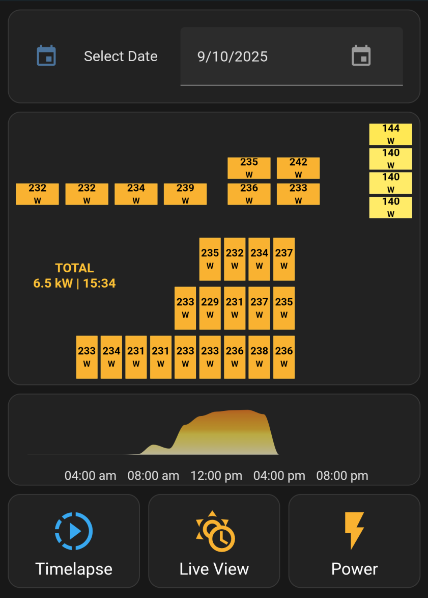
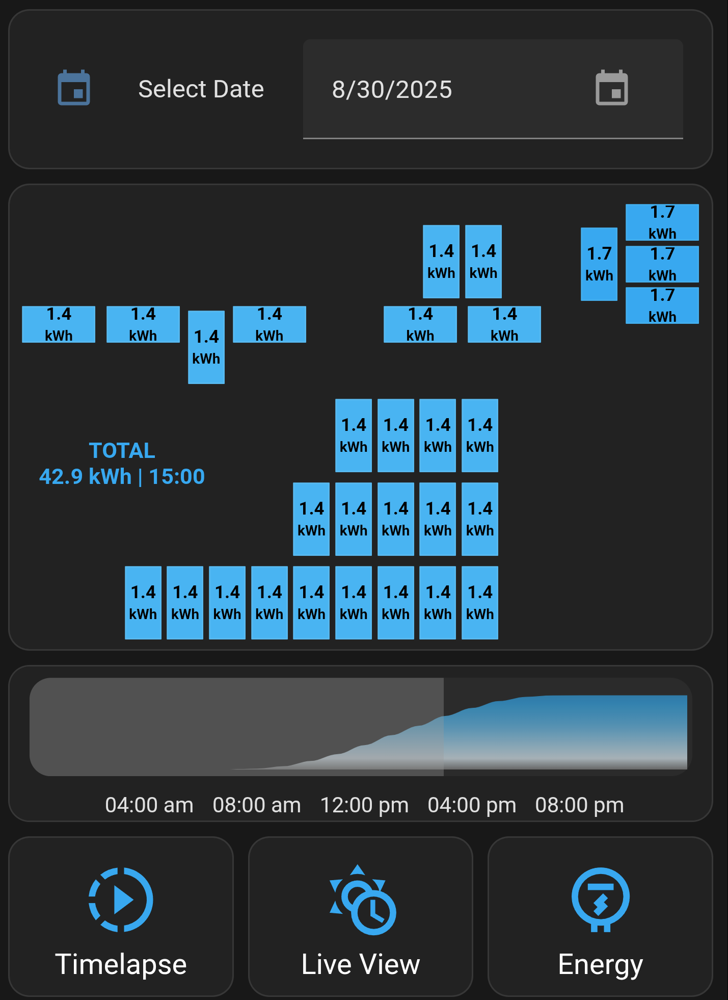

# Solar Panel Dashboard for Home Assistant (SunPower + InfluxDB)

A Home Assistant dashboard designed for **SunPower** solar panel systems, built using several HACS components and InfluxDB for data storage and querying.

This dashboard visualizes your solar panel production over time, allows you to browse historical data, and provides a live mode for up-to-date readings.

---

## ✨ Features

- 📊 **Visualize a day's solar panel production** in a custom dashboard
- 📅 **Select a date** to view historical data
- ⏱ **Select a time** using a 24-hour preview graph
- 🔄 **Toggle Live View** for the most recent data
- ⚡ **Switch between Power and Energy** views
- 🖥 **Timelapse Mode** (play through hourly values)

---

## 📖 What this is

- A **Home Assistant** dashboard for **SunPower** systems using the [krbaker/hass-sunpower](https://github.com/krbaker/hass-sunpower) HACS integration.
- A **bash script** (`query_panels.sh`) to query **InfluxDB** for power or energy values and save them for Home Assistant sensors.
- An **example Lovelace dashboard** (`dashboard.yaml`) that uses the queried data.  You need to customize your own panel layout.

---

## 🚫 What this is not

- ❌ This code does **not** provide panel-level details you didn’t already have.
- ❌ This will **not** work without a functional [krbaker/hass-sunpower](https://github.com/krbaker/hass-sunpower) integration.
- ❌ It will **not** retroactively populate historical data — InfluxDB will collect data going forward if its a first time setup.
- ❌ It will **not** automagically create your panel layout.  Use the example to customize your own placement.   

---

## 🛠 Tested On

- Home Assistant OS
- SunPower PVS6
- InfluxDB 1.xx

---

## 📦 Required Integrations

| Integration      | Repository                                    |
|-------------------|-----------------------------------------------|
| `hass-sunpower`   | [krbaker/hass-sunpower](https://github.com/krbaker/hass-sunpower) |
| `button-card`     | [custom-cards/button-card](https://github.com/custom-cards/button-card) |
| `mod-card`        | [thomasloven/lovelace-card-mod](https://github.com/thomasloven/lovelace-card-mod) |
| `apexcharts-card` | [RomRider/apexcharts-card](https://github.com/RomRider/apexcharts-card) |
| `mushroom`        | [piitaya/lovelace-mushroom](https://github.com/piitaya/lovelace-mushroom) |

---

## 📂 Repo Components

| File / Folder                       | Purpose                                                   |
|------------------------------------|-----------------------------------------------------------|
| `query_panels.sh`                   | Bash script to query InfluxDB for power/energy data   |
| `configuration.yaml`                | Home Assistant configuration additions                    |
| `dashboard.yaml`                    | Example Lovelace dashboard                                |
| `automation_refresh_panels_onselect.yaml` | Automation to refresh panels when selections change   |
| `automation_refresh_graph_onlive.yaml`     | Automation to refresh graphs/panels in live mode (default: 5 min) |
| `script_panels_timelapse.yaml` | Timelapse playback script   |

---

## 🖼 Example Screenshots

### Timelapse View

### Date Selection

### Power View

---

## ⚙️ Setup Instructions

1. **Install Required HACS Integrations** (see Required Integrations above).

2. **Ensure InfluxDB is Running & Collecting Data**  
   - This setup relies on InfluxDB v1.xx to store SunPower production data.
   - You can install the InfluxDB Home Assistant add-on here: [Install InfluxDB](https://my.home-assistant.io/redirect/supervisor_addon/?addon=a0d7b954_influxdb&repository_url=https%3A%2F%2Fgithub.com%2Fhassio-addons%2Frepository)
   - If setting up InfluxDB for the first time, historical data starts from now onward.

3. **Set up `query_panels.sh`**  
   - Place the script in your Home Assistant config folder (e.g., `/config/scripts/query_panels.sh`).
   - Execution rights:   (e.g., `chmod +x /config/scripts/query_panels.sh`).
   - Edit the InfluxDB connection details, panel count, or paths if you so chose.

4. **Update `configuration.yaml`**  
   - Review `configuration.yaml` and add to your own Home Assistant configuration. (sensors, inputs, shell commands)
   - Update any paths you may have changed in /query_panels.sh.
   - Restart Home Assistant.

5. **Import Automations and Scripts**  
   - Add `refresh_panels_onselect.yaml`, `refresh_panels_live.yaml`, and `play_panels_timelapse.yaml` to your automations/scripts.

6. **Load the Example Dashboard**  
   - Copy `dashboard.yaml` to create a new dashboard.
   - Add it as a new dashboard in Home Assistant’s UI.
   - Review the notes in dashboard.yaml for customization (colors, thresholds, intervals)

7. **Verify Data Flow**  
   - Ensure `query_panels.sh` is successfully pulling data from InfluxDB.
   - Run `/config/scripts/query_panels.sh`for usage (e.g., `/config/scripts/query_panels.sh -d 2025-07-31 -h 14 -e power_3 -m max -m power`).
   - Adjust entity names if using a different integration or naming convention.

---

## 🧩 Notes & Customization

- The bash script is designed for **krbaker/hass-sunpower** entities — you may need to adjust entity names if using other integrations.
- This setup queries **historical** values — without stored data, graphs and selections will be empty.
- Refresh intervals, graphs, and UI layout are customizable to suit your needs.

---

## 📄 License

MIT License — free to use, modify, and share.
