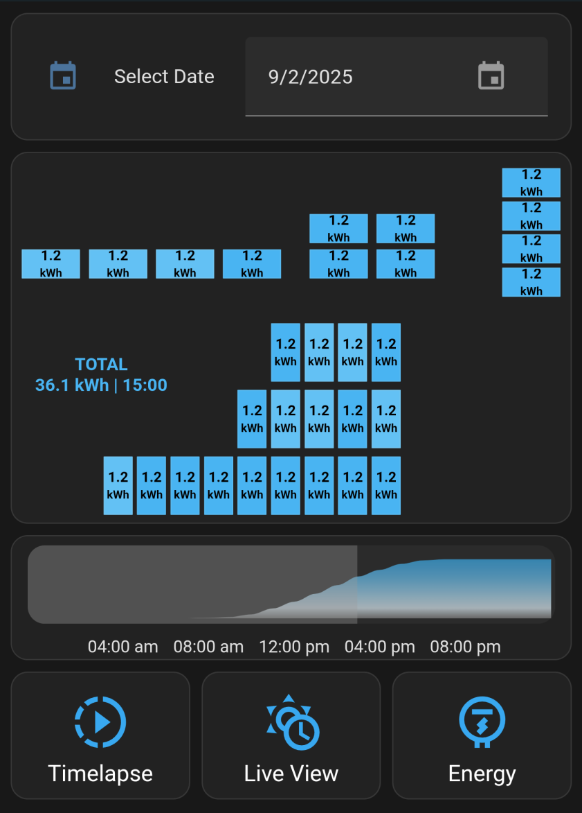

# SunPower Solar Panel Dashboard for Home Assistant

<div align="center">
  
</div>

This Home Assistant dashboard is built for SunPower PV systems using InfluxDB, [krbaker/hass-sunpower](https://github.com/krbaker/hass-sunpower), and several other HACS components. A Bash script powers the data queries, enabling solar production visualization over time, historical browsing, and latest updates in "live" mode.

---

## Table of Contents
1. [Features](#features)
2. [What this is](#what-this-is)
3. [What this is not](#what-this-is-not)
4. [Tested On](#tested-on)
5. [Required Integrations](#required-integrations)
6. [Repo Components](#repo-components)
7. [Screenshots](#screenshots)
8. [Setup Instructions](#setup-instructions)
9. [Troubleshooting](#troubleshooting)
10. [Credits](#credits)

---
## Features

- **Display individual solar panel production** in a custom dashboard.
- **Select a date** to view historical data.
- **Select a time** using a 24-hour preview graph and slider.
- **Toggle Live View** for the most recent data.
- **Toggle Power** to display production in Watts at a specific time.
- **Toggle Energy** to display production in kWh up to a specific time.
- **Timelapse** through a day's production.

---

## What this is

- A **Home Assistant** dashboard for **SunPower** systems using the [krbaker/hass-sunpower](https://github.com/krbaker/hass-sunpower) HACS integration.
- A **bash script** (`query_panels.sh`) to query **InfluxDB** for power or energy values and save them for Home Assistant sensors.
- An **example dashboard** (`dashboard.yaml`) that uses the queried data.  You need to customize your own panel layout.

---

## What this is not

- ❌ This setup does **not** provide additional panel-level details.  It uses data from your SunPower PVS
- ❌ This will **not** work without a functional [krbaker/hass-sunpower](https://github.com/krbaker/hass-sunpower) integration.
- ❌ It will **not** retroactively populate historical data — InfluxDB will collect data going forward if it is a first time setup.
- ❌ It will **not** automatically create YOUR panel layout.  Use the example to customize your own placement.

---

## Tested On

- Home Assistant OS
- SunPower PVS6
- InfluxDB 1.x

---

## Required Integrations

**Built using these amazing integrations!**

| Integration      | Repository                                    |
|-------------------|-----------------------------------------------|
| `hass-sunpower`   | [krbaker/hass-sunpower](https://github.com/krbaker/hass-sunpower) |
| `button-card`     | [custom-cards/button-card](https://github.com/custom-cards/button-card) |
| `mod-card`        | [thomasloven/lovelace-card-mod](https://github.com/thomasloven/lovelace-card-mod) |
| `apexcharts-card` | [RomRider/apexcharts-card](https://github.com/RomRider/apexcharts-card) |
| `mushroom`        | [piitaya/lovelace-mushroom](https://github.com/piitaya/lovelace-mushroom) |

---

## Repo Components

| File / Folder                       | Purpose                                                   |
|------------------------------------|-----------------------------------------------------------|
| `query_panels.sh`                   | Bash script to query InfluxDB for power/energy data   |
| `configuration.yaml`                | Required changes for Home Assistant's configuration.yaml  |
| `dashboard.yaml`                    | Example Home Assistant dashboard  |
| `automation_refresh_panels.yaml`    | Automation to refresh panels when selections change   |
| `automation_timelapse_panels.yaml`  | Automation to timelapse through a day |
| `panel_layout_trans.png`            | Transparent background image expected in /config/www/images/

---

## Screenshots

### Timelapse
<div align="center">
  
</div>

### Historical Energy
<div align="center">
  
</div>

### Live Power
<div align="center">
  
</div>

---

## Setup Instructions

**Before starting, consider trying this during the day. It is easier to troubleshoot when inverters are online**

1. **Install Required HACS Integrations**
  - [Required Integrations](#required-integrations)

2. **Setup InfluxDB**<br>
(This setup relies on InfluxDB 1.x to store SunPower production data.  If already setup, skip to: **Optional**.)
  - Install the InfluxDB Home Assistant add-on here: [Install InfluxDB](https://my.home-assistant.io/redirect/supervisor_addon/?addon=a0d7b954_influxdb&repository_url=https%3A%2F%2Fgithub.com%2Fhassio-addons%2Frepository).  If setting up InfluxDB for the first time, historical data starts from now onward.
  - Read the add-on documentation **Integrating into Home Assistant**.  Create at least 1 new user with **read/write** access to the "homeassistant" database. (e.g., `homeassistant`).
  - See the included **configuration.yaml** for a sample **INFLUXDB** configuration. Add to it your own configuration.yaml
     - Save the new username and password in `secrets.yaml` as
     ```
     influxdb_user: homeassistant
     influxdb_pass: yourpassword
     ```
  - Restart Home Assistant
  - **Optional:** create a new  InfluxDB user with **read-only** access to the homeassistant database for the query_panels.sh script.  (e.g., `powermonitor`)

3. **Set up `query_panels.sh`**<br>
(If you change paths make sure dashboard.yaml sensors and command match)
  - Create a `scripts` directory, in your Home Assistant config path.  Copy `query_panels.sh`  (e.g., `/config/scripts/query_panels.sh` or `/home/pi/.homeassistant/scripts/query_panels.sh`).
  - Edit `query_panels.sh` and replace the InfluxDB connection information.
  ```
  INFLUXDB_HOST="localhost:8086"
       USERNAME="powermonitor"
       PASSWORD="password"
       DATABASE="homeassistant"
  ```
  - Check the **${DATA_DIR}** path, created by the script, works for your Home Assistant install. The included `configuration.yaml` entries will need an update if changed.
  ```
       DATA_DIR="/config/power"             ### files written by this script
       ENTITIES="${DATA_DIR}/entities.txt"
      GRAPH_OUT="${DATA_DIR}/graph.json"
     PANELS_OUT="${DATA_DIR}/panels.json"
  ```
  - Execution rights (e.g., `chmod +x /config/scripts/query_panels.sh`).
  - Run `query_panels.sh --discover` to attempt sensor discovery. If successful, it will print the sensor entities needed in configuration.yaml and store them. (e.g., `/config/power/entities.txt`)
```
   /config/scripts/query_panels.sh --discover

Discovering lifetime_power and matching power sensors...

Found data for power_meter_pvs6mxxxxxxxxp_power matched from power_meter_pvs6mxxxxxxxxp_lifetime_power
Found data for inverter_e00122xxxxxxxxxx_power matched from inverter_e00122xxxxxxxxxx_lifetime_power

Use below in configuration.yaml for the timelapse_power_panels json_attributes

- power_meter_pvs6mxxxxxxxxp_power
- inverter_e00122xxxxxxxxxx_power
- inverter_e00123xxxxxxxxxx_power
...
```

4. **Update `configuration.yaml`**
  - Review the included `configuration.yaml` and add it to your own `configuration.yaml` (sensors, inputs, shell commands).
  - Update any paths you may have changed for `query_panels.sh`.  The **shell_command** points to the location of `query_panels.sh`.
  - Review `/config/power/entities.txt`. It should contain the sunpower entities after running (`/config/scripts/query_panels.sh --discover`)
  - Replace the `json_attributes` in `configuration.yaml`, for the command line sensor **timelapse_power_panels**, with the result of `query_panels.sh --discover`.
    ```
       json_attributes:
        - inverter_e00122xxxxxxxxxx_power
        - inverter_e00123xxxxxxxxxx_power
        - power_meter_pvs6mxxxxxxxxp_power
    ```
    - Make sure all discovered entities are added.
  - Restart Home Assistant.

5. **Import Automations and Scripts**
  - Add `automation_refresh_panels.yaml` to your automations
  - Add `automation_timelapse_panels.yaml` to your automations

6. **Load the Example Dashboard**
  - Copy `panel_layout_trans.png` to `/config/www/images/`.
  - Copy `dashboard.yaml` and add it as a new dashboard in Home Assistant’s UI.
  - Review the notes in [dashboard.yaml](https://github.com/strawtype/dash-sunpower/blob/master/dashboard.yaml) for customization (colors, thresholds, intervals).  Some comments will not get saved in the Home Assistant UI.
  - The dashboard is responsive and displays best in portrait orientation.
  - Each solar panel is an individual card that needs to be associated with its corresponding sensor_id in the next step.

7. **Customize the Dashboard**
  - To accurately place the panels on the dashboard you must already know their layout or physical placement.  Consult your install documentation or the SunPower app to identify the location of each panel by serial number.
  - The sensor ID names have changed over time but they are usually "power_xx" (legacy) or "inverter_e00122xxxxxxxxxx_power" (new).
  - In `dashboard.yaml` replace the template `triggers_update: power_meter_pvs6mxxxxxxxxp_power` with the main production meter entity.
  - Match each panel (card) to its corresponding entity id `power_key: inverter_e00122xxxxxxxxxx_power`.  Use the results from `query_panels.sh --discover`
  ```
  - type: custom:button-card
    template: solar_panel
    variables:
      power_key: inverter_e00122xxxxxxxxxx_power      ### EACH PANEL MUST BE ASSOCIATED TO ITS CORRESPONDING JSON ATTRIBUTE IN CONFIGURATION.YAML timelapse_power_panels
    style:        ### ADJUST PER PANEL, TO SET LOCATION
      left: 7%
      top: 30%
    styles:
      card:       ### HORIZONTAL LAYOUT OVERRIDE, REMOVE FOR VERTICAL
        - height: 5vw
        - width: 10vw
  ```
  - Match the main production sensor `power_key: power_meter_pvs6mxxxxxxxxp_power` to the TOTAL PRODUCTION card. The entity or device has a trailing "p" after the serial number.
  ```
  - type: custom:button-card
    template: solar_panel
    variables:
      power_key: power_meter_pvs6mxxxxxxxxp_power      ####TOTAL PRODUCTION POWER METER
  ```
  - If you are using the legacy names, the device ID includes the serial number to help you identify each panel.
  - Remove or add any necessary cards to match your panel count.
  - Buttons use white text and may be hard to read if you're using a light theme.

---

## Troubleshooting

**"Query failed. Is InfluxDB running?"**
  - Check the InfluxDB service is started on HomeAssistant
  - Make sure the host, username and password are correct in query_panels.sh
  - Check the user has read permissions to the homeassistant database.

**query_panels.sh --discover is empty**
  - In the absence of "Query failed", this means the entities could not be found in InfluxDB
  - Check the InfluxDB user (in `query_panels.sh`), has read access to the `homeassistant` database
  - Check the InfluxDB `configuration.yaml` details, and make sure homeassistant restarts if changed.
  - Query the database using: `SHOW TAG VALUES FROM "kWh" WITH KEY = "entity_id"`
    - This should list all your energy entities. If missing, check [krbaker/hass-sunpower] and InfluxDB settings (the database is not collecting).
    - SunPower entities exist, but `--discover` didn't find them?
      -  Try adding them manually to `/config/power/entities.txt`
      ```
      - power
      - power_10
      - power_11
      - power_12
      - power_13
      - power_14
      - power_15
      ```

**Zeros, Gray Panels**
  - Verify `query_panels.sh` can pull data from InfluxDB.
  - Run `/config/scripts/query_panels.sh` for usage (e.g., `/config/scripts/query_panels.sh -d 2025-07-31 -h 14 -e inverter_e00122xxxxxxxxxx_power -m max -m power`).
  - Test any entity found during `query_panels.sh --discover`, also stored at `/config/power/entities.txt`
    - Use a time and date after your inital InfluxDB and [krbaker/hass-sunpower] setup.
    - You will get empty values from dates that predate your InfluxDB setup.  Zeros are expected at night.
    - Check each panel (card) in the `dashboard.yaml` has its corresponding  **power_key:** with the correct sensor

**TOTAL doesn't work**
  - This card is in the `dashboard.yaml` labeled "PRODUCTION POWER METER"
  - Check the card has its corresponding  **power_key:** with the correct sensor, usually has a trailing **"p"** in the device and sensor ids.  (e.g., `power_meter_pvs6mxxxxxxxxp_power`)

**Broken UI**
  - Check each card has the correct association to a power sensor
  - Check `configuration.yaml` and make sure **timelapse_power_panels** has the correct **json_attributes**.  This should be the output of `entities.txt` after `--discover`.

**Missing Labels**
  - The example dashboard is expecting a "dark" theme. Some text labels are set to "white".

**Live Mode doesnt update, needs a refresh**
  - Trigger the button_card template in `dashboard.yaml` with the main production power meter:
      ```
button_card_templates:
  solar_panel:
    triggers_update: power_meter_pvs6mxxxxxxxxp_power   ####TOTAL PRODUCTION POWER METER
      ```
---

## Credits

This dashboard relies on several amazing Home Assistant integrations.

- [krbaker/hass-sunpower](https://github.com/krbaker/hass-sunpower) — SunPower integration.
- [custom-cards/button-card](https://github.com/custom-cards/button-card) — Custom button cards.
- [thomasloven/lovelace-card-mod](https://github.com/thomasloven/lovelace-card-mod) — Styling and card modifications.
- [RomRider/apexcharts-card](https://github.com/RomRider/apexcharts-card) — Charts and graphs.
- [piitaya/lovelace-mushroom](https://github.com/piitaya/lovelace-mushroom) — Number Input slider.

Thanks to everyone involved in these projects for their excellent work!

- [u/badxhabit28](https://reddit.com/user/badxhabit28) — Thanks for helping me test!
---

