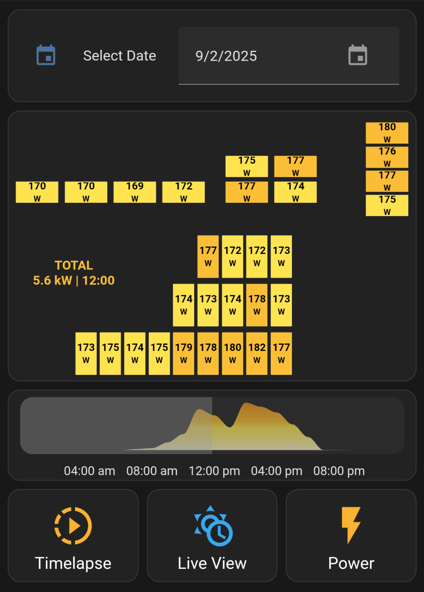

# Solar Panel Dashboard for Home Assistant (SunPower + InfluxDB)


A Home Assistant dashboard designed for **SunPower** PV systems, built using several HACS components, InfluxDB for data storage and a simple bash script for querying.<br>
The dashboard visualizes solar panel production over time, allows you to browse historical data, and provides a live mode for up-to-date readings.

---

## 📑 Table of Contents
1. [✨ Features](#-features)
2. [📖 What this is](#-what-this-is)
3. [🚫 What this is not](#-what-this-is-not)
4. [🛠 Tested On](#-tested-on)
5. [📦 Required Integrations](#-required-integrations)
6. [📂 Repo Components](#-repo-components)
7. [🖼 Screenshots](#-screenshots)
8. [⚙️ Setup Instructions](#-setup-instructions)
9. [🧩 Notes & Further Customization](#-notes--further-customization)
10. [🛠️ Troubleshooting](#-troubleshooting)
11. [📄 License](#-license)

---
## ✨ Features

- **Display individual solar panel production** in a custom dashboard.
- **Select a date** to view historical data.
- **Select a time** using a 24-hour preview graph and slider.
- **Toggle Live View** for the most recent data.
- **Toggle Power** to display production in Watts at a specific time.
- **Toggle Energy** to display production in kWh up to a specific time.
- **Timelapse** through a day's production.

---

## 📖 What this is

- A **Home Assistant** dashboard for **SunPower** systems using the [krbaker/hass-sunpower](https://github.com/krbaker/hass-sunpower) HACS integration.
- A **bash script** (`query_panels.sh`) to query **InfluxDB** for power or energy values and save them for Home Assistant sensors.
- An **example dashboard** (`dashboard.yaml`) that uses the queried data.  You need to customize your own panel layout.

---

## 🚫 What this is not

- ❌ This setup does **not** provide additional panel-level details.  It uses data from your SunPower PVS
- ❌ This will **not** work without a functional [krbaker/hass-sunpower](https://github.com/krbaker/hass-sunpower) integration.
- ❌ It will **not** retroactively populate historical data — InfluxDB will collect data going forward if it is a first time setup.
- ❌ It will **not** automatically create YOUR panel layout.  Use the example to customize your own placement.

---

## 🛠 Tested On

- Home Assistant OS
- SunPower PVS6
- InfluxDB 1.xx

---

## 📦 Required Integrations

| Integration      | Repository                                    |
|-------------------|-----------------------------------------------|
| `hass-sunpower`   | [krbaker/hass-sunpower](https://github.com/krbaker/hass-sunpower) |
| `button-card`     | [custom-cards/button-card](https://github.com/custom-cards/button-card) |
| `mod-card`        | [thomasloven/lovelace-card-mod](https://github.com/thomasloven/lovelace-card-mod) |
| `apexcharts-card` | [RomRider/apexcharts-card](https://github.com/RomRider/apexcharts-card) |
| `mushroom`        | [piitaya/lovelace-mushroom](https://github.com/piitaya/lovelace-mushroom) |

---

## 📂 Repo Components

| File / Folder                       | Purpose                                                   |
|------------------------------------|-----------------------------------------------------------|
| `query_panels.sh`                   | Bash script to query InfluxDB for power/energy data   |
| `configuration.yaml`                | Required changes for Home Assistant's configuration.yaml  |
| `dashboard.yaml`                    | Example Home Assistant dashboard  |
| `automation_refresh_panels_onselect.yaml` | Automation to refresh panels when selections change   |
| `automation_refresh_graph_onlive.yaml`     | Automation to refresh graphs/panels in live mode (default: 5 min) |
| `script_panels_timelapse.yaml` | Timelapse playback script   |
| `panel_layout_trans.png` | Transparent background image expected in /config/www/images/

---

## 🖼 Screenshots

### Timelapse View


### Energy View


### Power View


---

## ⚙️ Setup Instructions

1. **Install Required HACS Integrations**
  - See above

2. **Ensure InfluxDB is Running & Collecting Data**<br>
(This setup relies on InfluxDB v1.xx to store SunPower production data.  If already setup, skip to: **Optional**.)
  - Install the InfluxDB Home Assistant add-on here: [Install InfluxDB](https://my.home-assistant.io/redirect/supervisor_addon/?addon=a0d7b954_influxdb&repository_url=https%3A%2F%2Fgithub.com%2Fhassio-addons%2Frepository).  If setting up InfluxDB for the first time, historical data starts from now onward.
  - Create at least 1 new user with **read/write** access to the "homeassistant" database. (e.g., `homeassistant`).
  - See the included **configuration.yaml** for a sample **INFLUXDB** configuration. Add to it your own configuration.yaml
     - Save the new username and password in `secrets.yaml` as
     ```
     influxdb_user: homeassistant
     influxdb_pass: yourpassword
     ```
  - Restart Home Assistant
  - **Optional:** create a new user with **read-only** access to the homeassistant database for the query_panels.sh script.  (e.g., `powermonitor`)

3. **Set up `query_panels.sh`**<br>
(If you change paths make sure dashboard.yaml sensors and command match)
  - Create a `scripts` directory, in your Home Assistant config path.  Copy `query_panels.sh`  (e.g., `/config/scripts/query_panels.sh` or `/home/pi/.homeassistant/scripts/query_panels.sh`).
  - Edit `query_panels.sh` and replace the InfluxDB connection information.
  ```
  INFLUXDB_HOST="localhost:8086"
       USERNAME="powermonitor"
       PASSWORD="password"
       DATABASE="homeassistant"
  ```
  - Check the **${DATA_DIR}** path works for your Home Assistant install. The included `configuration.yaml` entries will need an update if changed.
  ```
       DATA_DIR="/config/power"             ### files written by this script
       ENTITIES="${DATA_DIR}/entities.txt"
      GRAPH_OUT="${DATA_DIR}/graph.json"
     PANELS_OUT="${DATA_DIR}/panels.json"
  ```
  - Execution rights (e.g., `chmod +x /config/scripts/query_panels.sh`).
  - Run (`query_panels.sh --discover`) to attempt sensor discovery. If successful, it should print the sensor entities needed in configuration.yaml in next steps.
  ```
   /config/scripts/query_panels.sh --discover

Discovering lifetime_power and matching power sensors...

Found data for power_meter_pvs6mxxxxxxxxp_power matched from power_meter_pvs6mxxxxxxxxp_lifetime_power
Found data for inverter_e00122xxxxxxxxxx_power matched from inverter_e00122xxxxxxxxxx_lifetime_power

Use below in configuration.yaml for the timelapse_power_panels json_attributes

- power_meter_pvs6mxxxxxxxxp_power
- inverter_e00122xxxxxxxxxx_lifetime_power
- inverter_e00122xxxxxxxxxx_lifetime_power
...
  ```

4. **Update `configuration.yaml`**
  - Review the included `configuration.yaml`.  Add it to your own `configuration.yaml` (sensors, inputs, shell commands).
  - Update any paths you may have changed for `query_panels.sh`.  Don't forget the **shell_command** points to the location of `query_panels.sh`.
  - Review `/config/power/entities.txt`, it should exist after running (`/config/scripts/query_panels.sh --discover`)
  - Replace the `json_attributes` in `configuration.yaml`, for the command line sensor **timelapse_power_panels**, with the result of `query_panels.sh --discover`.
    ``` json_attributes:
        - inverter_e00122xxxxxxxxxx_lifetime_power
        - inverter_e00122xxxxxxxxxx_lifetime_power
        - inverter_e00122xxxxxxxxxx_lifetime_power
        - power_meter_pvs6mxxxxxxxxp_lifetime_power
    ```
    - Make sure all discovered entities are added.
  - Restart Home Assistant.

5. **Import Automations and Scripts**
  - Add `automation_refresh_panels_onselect.yaml` to your automations
  - Add `automation_refresh_graph_onlive.yaml` to your automations
  - Add `script_panels_timelapse.yaml` to your scripts

6. **Load the Example Dashboard**
  - Copy `dashboard.yaml` to create a new dashboard.
  - Add it as a new dashboard in Home Assistant’s UI.
  - Review the notes in dashboard.yaml for customization (colors, thresholds, intervals)
  - Each solar panel is an individual card that needs to be associated with its corresponding sensor_id in the next step.

7. **Customize the Dashboard**
  - To accurately place the panels on the dashboard you must already know their layout or physical placement.  Consult your install documentation or the SunPower app to identify the location of each panel by serial number.
  - The sensor ID names have changed over time but they are usually "power_xx" (legacy) or "inverter_e00122xxxxxxxxxx_power" (new).
  - In `dashboard.yaml` match each panel (card) to its corresponding  **power_key: power_8**  or  **power_key: inverter_e00122xxxxxxxxxx_power** entity_id.  Use the results from `query_panels.sh --discover`
  ```
  - type: custom:button-card
    template: solar_panel
      variables:
    power_key: inverter_e00122xxxxxxxxxx_lifetime_power
  ```
  - Match the main production sensor `power_key: power_meter_pvs6mxxxxxxxxp_power`. The entity likely has a "p" at the end for "production".
  ```
  - type: custom:button-card
    template: solar_panel
    variables:
      power_key: power      ####TOTAL PRODUCTION POWER METER "power_meter_pvs6mxxxxxxxxp_power"
  ```
  - If you are using the legacy names, the device ID includes the serial number to help you identify each panel.
  - Remove or add any necessary cards to match your panel count.
  - Some buttons have white text, which may hard to read in "light" themes.

---

## 🧩 Notes & Further Customization

  - The bash script is designed for **krbaker/hass-sunpower** entities — you may need to adjust entity names if using other integrations.
  - This setup queries **historical** values provided by InfluxDB. Without stored data, graphs and selections will be empty.
  - `query_panels.sh` only needs InfluxDB read access.

---

## 🛠️ Troubleshooting

**"Query failed. Is InfluxDB running?"**
  - Check the InfluxDB service is started on HomeAssistant
  - Make sure the host, username and password are correct in query_panels.sh
  - Check the user has read permissions to the homeassistant database.

**query_panels.sh --discover is empty**
  - In the absence of "Query failed", this means the entities could not be found in InfluxDB
  - Check the InfluxDB user (in `query_panels.sh`), has read access to the `homeassistant` database
  - Check the InfluxDB `configuration.yaml` details, and make sure homeassistant restarts if changed.
  - Query the database using with `SHOW TAG VALUES FROM "kWh" WITH KEY = "entity_id"`
    - This should all your energy entities. If missing, check [krbaker/hass-sunpower] and InfluxDB settings (the database is not collecting).
    - SunPower entities exist, but `--discover` didn't find them?
      -  Try adding them manually to `/config/power/entities.txt`
      ```
      - power
      - power_10
      - power_11
      - power_12
      - power_13
      - power_14
      - power_15
      ```

**Zeros, Gray Panels**
  - Verify `query_panels.sh` can pull data from InfluxDB.
  - Run `/config/scripts/query_panels.sh` for usage (e.g., `/config/scripts/query_panels.sh -d 2025-07-31 -h 14 -e inverter_e00122xxxxxxxxxx_power -m max -m power`).
  - Test any entity found during `--discover` with a time and date greater than your InfluxDB setup.
    - You will get empty values from dates that predate your InfluxDB setup.  Zeros are expected at night.
    - Check each panel (card) in the `dashboard.yaml` has its corresponding  **power_key:** with the correct sensor

**TOTAL doesn't work**
  - This card is in the `dashboard.yaml` labeled "PRODUCTION POWER METER"
  - Check the card has its corresponding  **power_key:** with the correct sensor, usually has a trailing **"p"** in the device and sensor ids.  (e.g., `power_meter_pvs6mxxxxxxxxp_power`)

**Broken UI**
  - Check each card has the correct association to a power sensor
  - Check `configuration.yaml` and make sure **timelapse_power_panels** has the correct **json_attributes**.  This should be the output of `entities.txt` after `--discover`.

**Missing Labels**
  - The example dashboard is using a "dark" theme. Some text labels are set to "white"
---

## 📄 License

MIT License — free to use, modify, and share.
